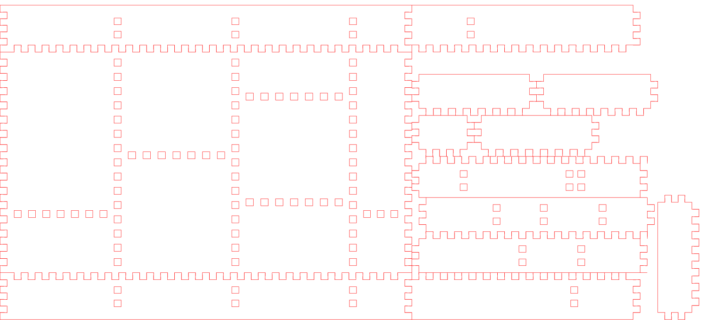

# divbox

Branch|[](https://travis-ci.org)|[](https://www.codecov.io)
---|---|---
`master`|[](https://travis-ci.org/richelbilderbeek/divbox) | [](https://codecov.io/github/richelbilderbeek/divbox?branch=master)
`develop`|[](https://travis-ci.org/richelbilderbeek/divbox) | [](https://codecov.io/github/richelbilderbeek/divbox?branch=develop)

General purpose box with divisions, written by Martijn Versteeg. Adaptations by Richel Bilderbeek.



## Download

 * Windows executable: [here](http://www.richelbilderbeek.nl/divbox.zip)
 * Linux executable: [here](http://www.richelbilderbeek.nl/divbox_linux.zip)

## Compiling

You need the cairo libs (libcairo2-dev package on ubuntu 10.10).

Run 'make fixbuild' the first time you compile. 
After that 'make' should do the job. 
If you want to hack on te program you can use 'nake depend' to generate dependencies.

## Useage

```
Usage: divbox [file]\n
  Reads a description of a box from a file or stdin and writes an eps file for the lasercutter\n\n
Syntax of the input.\n
  #                     Lines starting with # are ignored.\n
  B <w> <l> <h> [dh]    Specify box dimensions, Width, Length, Height   and optionally the height of the divisions (if omitted dh will equal h).\n
  N <name.eps>          Set the name of the outputfile.\n
  T <t> [tw] [taper]    Set the thickness of the material, and optionally the size of the teeth and the amount of tapering  of the teeth.\n
  D <pos>               Add a horizontal division at location <pos> along the <l> side of the box.\n
  V <pos>               Add a vertical division in the current horizontal box at location <pos> along the <w> side of the box.\n
  X (or EOF)            Exit the program and write the file\n.);
```

## Files

Filename|Description
---|---
divbox.cpp      | The classes implementing the box layout code
divbox.h        | The classes implementing the box layout code
lasercutter.cpp |	General lasercutter utility functions (layers over cairo) might be useful in other projects.
lasercutter.h   | General lasercutter utility functions (layers over cairo) might be useful in other projects.
main.cpp			  | Parser for inputfile
makefile        | Makefile
testbox 			  | Example

## Known Bugs

 * Two vdivs in adjacent gaps on the same location don't work yet.
 * multipage doesn't work yet

## Example

 * see [testbox](testbox)

